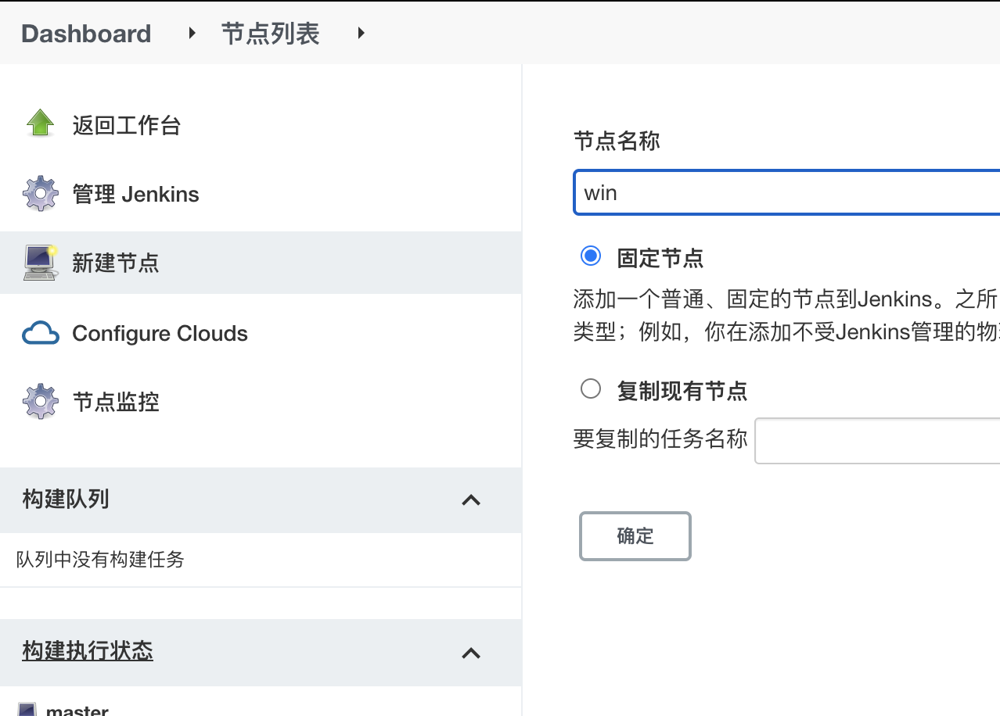
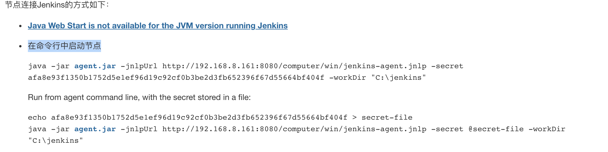
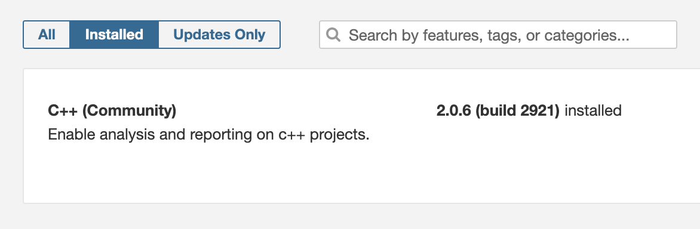

# 文档

## 1. 流水线基础设施搭建

常用的流水线基础设施有：

1. CI 平台：Jenkins 
2. 质量分析：Sonarqube
3. 代码管理：Gitlab
4. 制品库：Nexus 

在 Linux 上本地启动可以使用 Docker Compose，参考 cicd 目录中的配置文件即可启动，如果已经有相关环境略过。

### Windows 节点配置方法

在 Windows 运行构建任务可以配置 Windows 节点。


1） 开通防火墙


- Slave →  Master 默认 50000（全局安全配置→代理 查看）
- Master → Slave 和 Jenkins web 端口一致，比如 80、443

建议互通，也就是相互端口都开

2）创建节点

进入 Dashboard → 节点列表 → 新建节点。



3 ） 填写相关参数

有两个需要注意：

1. 远程工作目录
2. 启动方式应该使用 Java Web 启动代理

远程工作目录在 Window 下使用类似 c:\jenkins 的路径即可。

操作完成，保存然后下一步。

4 ）连接代理

**进入代理机** 安装 JDK 8，登录 Jenkins 进入节点管理详情，详情中会展示两种启动连接方式，推荐使用 “在命令行中启动节点”。



首先点击 agent.jar 下载文件，放到合适的目录后。运行后面的命令启动即可。

## 2. 包管理

包管理有下面几种方法

1. Conan
2. 放到代码库中 
3. 放到单独的代码库，使用 git submodule <<<<

## 3. Sonar C++ 插件安装

Sonar 上提供了一些商业插件比如 SonarCFamily 可以使用，也可以使用开源插件。

我们可以使用 sonar-cxx，为社区版添加 C++支持，也可以使用 Sonar Cloud，但是 Sonar Cloud 需要单独配置。

插件安装文档见：https://github.com/SonarOpenCommunity/sonar-cxx/wiki/Install-the-Plugin  特别注意兼容性清单。

如果使用 Docker 启动，可以下载相关插件后使用下面的命令，将插件拷贝到 Sonar 的对应目录中。（操作前最好备份一下 sonar 的数据库）。

>  docker cp [插件位置]   [容器 ID]:/opt/sonarqube/extensions/plugins

安装完成后，可以在 Administration → Marketplace → Plugins 找到。



### 4. 静态扫描

##### 本地使用 sonar-scanner 上报报告：

> Brew install sonar-scanner

**clang-format**

代码风格检查

TODO 

##### cppcheck 

 可以检测潜在的问题。

安装地址：https://cppcheck.sourceforge.io/

使用方式：

```
# code check
cppcheck --xml-version=2 . 2> report.xml

# sonar report
sonar-scanner -Dsonar.login=57e10da238ad6c9308ec444eacd03ba8c25ca735
```

## 5. 构建运行节点方案

由于每个项目不同，需要不同的构建方案。

1. Linux 可以使用配置不同的 docker 来进行构建
2. Win 使用 Windows 节点即可

Linux 构建节点工具清单

- cmake
- g++/clang 
- Cppcheck
- SonarQube Scanner
- 其他依赖文件


##### Docker 镜像构建

准备 Dockerfile 如下：

```dockerfile
FROM gcc:11

ARG CMAKE_VERSION=3.20.5
ARG LLVM_VERSION=13.0.0
ARG SONAR_SCANNER_CLI_VERSION=4.6.2.2472

RUN wget https://github.com/Kitware/CMake/releases/download/v${CMAKE_VERSION}/cmake-${CMAKE_VERSION}-Linux-x86_64.sh \
      -q -O /tmp/cmake-install.sh \
      && chmod u+x /tmp/cmake-install.sh \
      && mkdir /usr/bin/cmake \
      && /tmp/cmake-install.sh --skip-license --prefix=/usr/bin/cmake \
      && rm /tmp/cmake-install.sh \
      && ln -s /usr/bin/cmake/bin/ccmake /usr/local/bin/ccmake \
      && ln -s /usr/bin/cmake/bin/cmake /usr/local/bin/cmake \
      && ln -s /usr/bin/cmake/bin/cpack /usr/local/bin/cpack \
      && ln -s /usr/bin/cmake/bin/ctest /usr/local/bin/ctest

# TODO add more tools
```

使用命令：

>  docker build -t  builder/gcc:latest   .


##### 添加 Docker 构建节点

